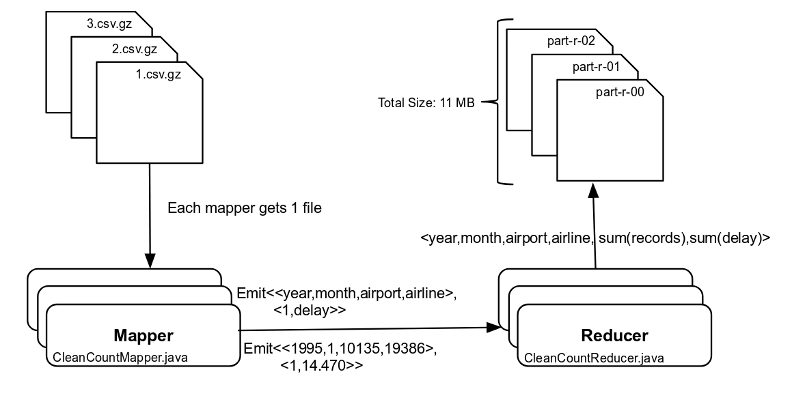

```{r setup, include=FALSE, warning=FALSE}
knitr::opts_chunk$set(echo = TRUE)
require("ggplot2")
require("reshape2")
require("knitr")
require("kableExtra")
require("dplyr")
require("RColorBrewer")
```

```{r echo=FALSE, warning=FALSE, message=FALSE}
filenames <- list.files(path = "output/", pattern = "part-r-*", full.names = TRUE) 
master_df <- do.call("rbind", lapply(filenames, read.csv, header = FALSE))
colnames(master_df) <- c("year", "month", "airport_code", "airline_code", "count", "sumDelay")

airline_lookup <- read.csv(file = "lookup/L_AIRLINE_ID.csv")
airport_lookup <- read.csv(file = "lookup/L_AIRPORT_ID.csv")
airport_code_lookup <- read.csv(file = "lookup/L_AIRPORT.csv")

airport <- merge(airport_lookup,airport_code_lookup,by=c("Description"))

airport_lookup_code <- data_frame(airport$Code.x,airport$Code.y, airport$Description)
colnames(airport_lookup_code) <- c("code", "airport_char_code", "airport")

#master_df <- merge(master_df, airline_lookup, by.x=c("airline_code"),by.y=c("Code"))
#colnames(master_df)[which(names(master_df) == "Description")] <- "airline"

#airport_df <- merge(airport_df, airport_lookup_code, by.x=c("code"),by.y=c("airport$Code.x"))
#airport_df <- merge(airport_df, airport_lookup_code, by.x=c("code"),by.y=c("airport$Code.y"))

#colnames(airport_df)[which(names(airport_df) == "airport$Code.y")] <- "airport_code"
#colnames(airport_df)[which(names(airport_df) == "airport$Description")] <- "airport_full_name"

#master_df$airline <- as.character(master_df$airline)

#master_df <- master_df %>% 
#  mutate(airline_char_code = ifelse(lengths(strsplit(airline, ':')) > 1, trimws(strsplit(airline, ':')[[1]][2]), airline)) %>%
#  mutate(airline = ifelse(lengths(strsplit(airline, ':')) > 1, trimws(strsplit(airline, ':')[[1]][1]), airline))

#airport_df %>%group_by(code)%>% top_n(n=5)
# Top 5 Airlines
top5Airlines <- master_df %>% 
  group_by(airline_code) %>% 
  summarise(total = sum(count)) %>% 
  arrange(desc(total)) %>% 
  top_n(5)

top5Airlines <- merge(airline_lookup, top5Airlines, by.x=c("Code"), by.y=c("airline_code"))
colnames(top5Airlines)[which(names(top5Airlines) == "Description")] <- "airline"
colnames(top5Airlines)[which(names(top5Airlines) == "Code")] <- "airline_code"
top5Airlines$airline <- as.character(top5Airlines$airline)
top5Airlines <- top5Airlines %>% rowwise() %>%
  mutate(airline_char_code = ifelse(lengths(strsplit(airline, ':')) > 1, trimws(strsplit(airline, ':')[[1]][2]), airline)) %>%
  mutate(airline_char_code = ifelse(lengths(strsplit(airline_char_code, '\\s+')) > 1, trimws(strsplit(airline_char_code, '\\s+')[[1]][1]), airline_char_code)) %>%
  mutate(airline = ifelse(lengths(strsplit(airline, ':')) > 1, trimws(strsplit(airline, ':')[[1]][1]), airline)) %>% 
  arrange(desc(total))

#Top 5 Airports
top5Airports <- master_df %>% 
  group_by(airport_code) %>% 
  summarise(total = sum(count)) %>% 
  arrange(desc(total)) %>% 
  top_n(5)

top5Airports <- merge(top5Airports,airport_lookup_code, by.x=c("airport_code"), by.y=c("code"))
top5Airports$airport <- as.character(top5Airports$airport)

top5Airports <- top5Airports %>% rowwise() %>%
  mutate(airport = ifelse(lengths(strsplit(airport, ':')) > 1, trimws(strsplit(airport, ':')[[1]][2]), airport)) %>% 
  arrange(desc(total))

## Top 5 Airline processing  
top5AirlinesData <- master_df %>% 
           filter(airline_code %in% top5Airlines$airline_code)
top5AirlinesData <- top5AirlinesData %>% 
  group_by(airline_code, year) %>% 
  #summarise(total_count = sum(count), total_delay = sum(sumDelay)) %>% 
  #mutate(mean_delay = total_delay / total_count)
  mutate(mean_delay = sumDelay / count)

top5AirlinesGraphData <- merge(top5Airlines, top5AirlinesData)

plot_top5AirlinesData <- ggplot(data = top5AirlinesGraphData, mapping = aes(x = factor(month), y=mean_delay, color=factor(airline_char_code), width=.95)) +
  facet_wrap(factor(airline_char_code) ~ factor(year), ncol=29)  +
  scale_y_continuous(breaks = seq(0, 0.20, by = 0.05), limits=c(0, 0.20)) + 
  scale_color_manual(values = c(brewer.pal(7,"Dark2")), name="Airline") +
  #geom_point(size=0.2) + 
  stat_summary(fun.y = median, geom = 'point',  size=0.5) +
  #stat_summary(aes(y = mean_delay,group = 1), fun.y=mean, geom="line") + 
  scale_x_discrete(labels=c("1"="Jan","2"="","3"="","4"="","5"="","6"="","7"="","8"="","9"="","10"="","11"="Dec","12"=""))+
  #theme(strip.background = element_blank(), strip.text.x = element_blank(), axis.ticks.x=element_blank(), panel.grid = element_blank())
  theme(axis.ticks.x=element_blank(),axis.text.x = element_text(angle = 90, hjust = 1), strip.text=element_text(size=6), panel.grid.major.y = element_line(colour = "#808080")) + 
  labs(x = "Month", y = "Normalized Delay", title="Fig 4.2 Normalized delay of top 5 airlines from 1987-2015")


# Top 5 Airport Processing 
top5AirportsData <- master_df %>% 
           filter(airport_code %in% top5Airports$airport_code)
top5AirportsData <- top5AirportsData %>% 
  group_by(airport_code, year) %>% 
  #summarise(total_count = sum(count), total_delay = sum(sumDelay)) %>% 
  #mutate(mean_delay = total_delay / total_count)
  mutate(mean_delay = sumDelay / count)

top5AirportsGraphData <- merge(top5Airports, top5AirportsData)

plot_top5AirportsData <- ggplot(data = top5AirportsGraphData, mapping = aes(x = factor(month), y=mean_delay, color=factor(airport_char_code), width=.95)) +
  facet_wrap(factor(airport_char_code) ~ factor(year), ncol=29)  +
  scale_y_continuous(breaks = seq(0, 0.20, by = 0.05), limits=c(0, 0.20)) + 
  scale_color_manual(values = c(brewer.pal(7,"Dark2")),  name="Airport") +
  #geom_point(size=0.2) + 
  stat_summary(fun.y = median, geom = 'point',  size=0.5) +
  #stat_summary(aes(y = mean_delay,group = 1), fun.y=mean, geom="line") + 
  scale_x_discrete(labels=c("1"="Jan","2"="","3"="","4"="","5"="","6"="","7"="","8"="","9"="","10"="","11"="Dec","12"=""))+
  #theme(strip.background = element_blank(), strip.text.x = element_blank(), axis.ticks.x=element_blank(), panel.grid = element_blank())
  theme(axis.ticks.x=element_blank(),axis.text.x = element_text(angle = 90, hjust = 1), strip.text=element_text(size=6), panel.grid.major.y = element_line(colour = "#808080")) + 
  labs(x = "Month", y = "Normalized Delay", title="Fig 4.1 Normalized delay of top 5 airports from 1987-2015")
  #theme(axis.ticks.x=element_blank(), axis.text.x = element_text(angle = 90, hjust = 1))
#plot_top5AirlinesData


## Seasonal Trends
seasonalData <- master_df %>%
    #filter(airport_code %in% top5Airports$airport_code) %>%
    group_by(month) %>%
    summarise(total_count = sum(count), total_delay = sum(sumDelay)) %>% 
    mutate(mean_delay = total_delay / total_count) 
seasonalData <- data.frame(master_df)
seasonalData$mean_delay <- seasonalData[,"sumDelay"]/seasonalData[,"count"]
seasonalData <- seasonalData %>% filter(mean_delay <= 1.0)

plot_seasonalData <- ggplot(data = seasonalData, aes(y=mean_delay, x=factor(month))) + 
  scale_y_continuous(breaks = seq(0, 0.35, by=0.05), limits=c(0, 0.35)) + 
  scale_x_discrete(labels=c("1"="Jan", "2"="Feb", "3" = "Mar", "4"="Apr", "5"="May", "6"="Jun", 
                             "7"="Jul", "8"="Aug", "9"="Sep", "10"="Oct", "11"="Nov", "12"="Dec")) + 
  geom_violin(alpha=0.2, scale="count", draw_quantiles = c(0.05, 0.50, 0.95)) + 
  #stat_summary(
  #mapping = aes(x = factor(month), y = mean_delay, group = 2),
  #fun.ymin = function(z) { quantile(z,0.05) },
  #fun.ymax = function(z) { quantile(z,0.95) },
  #fun.y = median) +
  theme_bw() + 
  labs(x="Month", y = "Normalized Delay", title="Fig 4.5 Seasonal Normalized Mean Delay Distribution from 1987-2015") + 
  theme(plot.title = element_text(size = 9), axis.text =element_text(size=8), axis.title =element_text(size=9))

## All violin distributions across airports
allTop5AirportsData <- master_df %>% 
           filter(airport_code %in% top5Airports$airport_code) %>%
           mutate(mean_delay = sumDelay  / count) 

allTop5AirportsData <- merge(top5Airports, allTop5AirportsData)

plotAllTop5Airports <- ggplot(data = allTop5AirportsData, aes(y=mean_delay, x=airport_char_code)) + 
  scale_y_continuous(breaks = seq(0, 1.0, by=0.1), limits=c(0, 1)) +
  geom_violin(scale="count", draw_quantiles = c(0.05, 0.50, 0.95)) + 
  #geom_boxplot(width=0.1, aes(lower=quantile(y, 0.05), upper=quantile(y, 0.75)), coef=0, notch = TRUE) + 
  theme_bw() + 
  labs(x = "Airport", y = "Normalized Delay", title = "Fig 4.3 Nomalized delay distribution of top 5 airports from 1987-2015") + 
  theme(plot.title = element_text(size = 9), axis.text =element_text(size=8), axis.title =element_text(size=9))


## All violin distributions across airlines
allTop5AirlinesData <- master_df %>% 
           filter(airline_code %in% top5Airlines$airline_code) %>%
           mutate(mean_delay = sumDelay  / count) 
allTop5AirlinesData <- merge(top5Airlines, allTop5AirlinesData)

plot_allTop5Airlines <- ggplot(data = allTop5AirlinesData, aes(y=mean_delay, x=airline_char_code)) + 
  scale_y_continuous(breaks = seq(0, 1.0, by=0.1), limits=c(0, 1)) +
  geom_violin(scale="count", draw_quantiles = c(0.05, 0.50, 0.95)) + 
  theme_bw() + 
  labs(x = "Airline", y = "Normalized Delay", title = "Fig 4.4 Normalized delay of top 5 airlines from 1987-2015") + 
  theme(plot.title = element_text(size = 9), axis.text =element_text(size=8), axis.title =element_text(size=9))  


bm <- read.csv('bm.csv')
plotBM <- ggplot(data = bm, aes(y=timeInMin, x=factor(runtime), fill=factor(isHadoop))) +
  geom_bar(color="white", stat = "identity", position="dodge", show.legend=FALSE) + 
  scale_x_discrete(limits = factor(bm$runtime)) +
  theme_bw() + 
  scale_fill_grey(start = 0.5, end = 0.8) +
  labs(x = "Runtime", y = "Time(Minutes)", title = "Fig 4.6 Comparision of runtimes - Hadoop Vs Spark") + 
  theme(plot.title = element_text(size = 9), axis.text =element_text(size=8), axis.title =element_text(size=9))  

#plot_allTop5Airlines
```

## 1. Introduction

This report discusses the design decisions and the corresponding runtimes for solving [A4 - On-Time Performance Data](http://janvitek.org/pdpmr/f17/task-a4-delay.html).

## 2. Environment

\vspace{-5mm}
\begin{wraptable}[2]{L}{21cm}
\hspace{2mm}\textbf{Table 2.a Local Mode Environment} \hspace{7.5cm}\textbf{Table 2.b AWS Environment}  \newline
    \begin{tabular}{c}
```{r echo=FALSE, results = 'asis', warning=FALSE, message=FALSE}
#The reports generated were executed by a program which was run in pseudo distributed mode in the following environment:

#  + **Local Pseudo Distributed Mode Environment**
  
sys_data <- read.csv('sysinfo.csv')
kable(sys_data, format="latex", booktabs=T)
```
     \hspace{4cm}
```{r echo=FALSE, results = 'asis', warning=FALSE, message=FALSE}
#  + **AWS Environment**
#    \newline Following table lists the basic parameters. Complete instance information can be found at the official site - #https://aws.amazon.com/ec2/instance-types/
sys_data <- read.csv('aws.csv')
kable(sys_data, format="latex", booktabs=T)
```
    \end{tabular}
\end{wraptable}\leavevmode

\vspace{4cm}
\hspace{1cm} Complete instance information can be found at the official site - https://aws.amazon.com/ec2/instance-types/

## 3. Architecture

#{width=310px, height=270px}

  + The program starts from `Boot.java`. The program uses only 1 job. 
  
  + The class which does sanitization of each record is located in `Sanitizer.java`. It returns a record `<year, month, airport, airline, normalized-delay>` wrapped in an object of type `SanitizedRecord` when the record is valid. Record splitting uses `CSVParser`. The delay is normalized as `arrivalDelayMin/CSRElapsedTime` for flights which were not cancelled. For cancelled flights, the normalized delay is `4.0`.
  
  + **CleanCountMapper** receives each record from a file. When a valid record is found, it emits `<<year, month, airport, airline>, <1, normalized-delay>>`. I restricted the mapper to receive each input file per map task since `gz` format is unsplittable and most of the files expand to sizes of around 150 MB which is neither too large or small for a mapper.
  
  + **CleanCountReducer** receives the record key as `<year, month, airport, airline>` from the mapper and aggregates the value as total counts and delays for that month. Thus, for a given airport and airline, it has aggregated the number of flights and the corresponding aggregated normalized delay. There is no limit on the number of reducers.
  
  + The total size of all the output files after running the job is 11 MB which is small enough to be loaded in R. Further processing is carried out in R.

## 4. Analysis
```{r echo=FALSE}
top5AirportsFormattedData <- top5Airports %>% 
        select(-total) %>% 
        rename(code = airport_char_code, id = airport_code) #%>%
        #mutate(airport = gsub("[^a-zA-Z]", " ", airport))
top5AirlinesFormattedData <- top5Airlines %>% 
        rename(code = airline_char_code, id = airline_code) %>%
        select(id, code, airline, -total)
```

\vspace{-5mm}
\begin{wraptable}[1]{L}{21cm}
\hspace{2mm}\textbf{Table 4.a Top 5 Active airports} \hspace{8cm} \textbf{Table 4.b Top 5 Active Airlines}  \newline
\begin{tabular}{c}
```{r echo=FALSE, warning=FALSE, message=FALSE, results='asis'}
kable(top5AirportsFormattedData, format="latex", booktabs=T, escape  = TRUE)
```
\hspace{4cm}
```{r echo=FALSE, warning=FALSE, message=FALSE, results='asis'}
### Top 5 Active Airlines
kable(top5AirlinesFormattedData, format="latex", booktabs=T, escape = TRUE)
```
\end{tabular}
\end{wraptable}\leavevmode

\vspace{3cm}

### 4.1 Normalized delay of Top 5 Airports
```{r echo=FALSE, warning=FALSE, message=FALSE, fig.width=13, fig.height=8, eval=T}
plot_top5AirportsData
```

The plot in `Fig 4.1` shows the distribution of mean delay of each month from 1987-2015 for the top 5 airports. The x-axis shows months for the past 30 years. Months are grouped into years. The y-axis has the normalized delay for each month. Each point in the graph represents the median delay of that airport across all airlines. 

From the `Fig 4.1` plot, it is clear that the delays across airports have reduced. Among the top 5 airports, there seem to be heavy delays for most of the months in the year - 2000. Post 2000, all airport delays are smaller as compared to pre 2000. This is clear in the graphs of airports like Los Angeles and Denver where the hurricane months of June, July and August do not seem to have much effect on the overall normalized delay of each month.

### 4.2 Normalized delay of Top 5 Airlines
```{r echo=FALSE, warning=FALSE, message=FALSE, fig.width=13, fig.height=8, eval=T}
plot_top5AirlinesData
```

The plot in `Fig 4.2` shows the distribution of mean delay of each month from 1987-2015 for the top 5 airlines. The x-axis shows months for the past 30 years. Months are grouped into years. The y-axis has the normalized delay for each month. Each point in the graph represents the median delay of that airline across all airports.

From the `Fig 4.2` plot, it is clear that there is a gradual reduction in airline delays over the past 30 years. From the year 2000 onward, the airline delays were comparatively lower.

### 4.3 Distribution of delay across Top 5 Airports and Top 5 Airlines

```{r echo=FALSE, warning=FALSE, message=FALSE, fig.width=4, fig.height=3}
plotAllTop5Airports
plot_allTop5Airlines
```

The graph in `Fig 4.3` plots the distribution of normalized delays for the top 5 airports The lines within each of the violin plot represent the quantiles at **[0.05, 0.50, 0.95]**. The width of the violin plot is proportional to the number of points which have the same normalized delay. The y-axis has the normalized delay. So, each point in the distribution is the monthly mean for that airline and airport. Delay is clipped at **1.0** which leads led to loss of less than 0.001% of points.

This plot helps us correlate the actual distribution with the plot from `Fig 4.1`. Consider an airport like **LAX** whose median delay from `Fig 4.3` is the lowest. However from this plot, it is clear that the bottom 5 percentile of delays is worse than other airports. **ORD** has consistent delays across the whole delay spectrum. The median delay at **ORD** is much worse than the rest of the top 5 airports. Overall, **DFW** shows comparatively smaller deviation of mean delays as compared to the rest of the top airports.

```{r echo=FALSE, warning=FALSE, message=FALSE, fig.width=6.5, fig.height=3, eval=F}
### Distribution of delay across Top 5 Airlines
plot_allTop5Airlines
```

The graph in `Fig 4.4` plots the distribution of normalized delays for the top 5 airlines The lines within each of the violin plot represent the quantiles at **[0.05, 0.50, 0.95]**. The width of the violin plot is proportional to the number of points which have the same normalized delay. The y-axis has the normalized delay. So, each point in the distribution is the monthly mean for that airline and airport. Delay is clipped at **1.0** which leads led to loss of less than 0.001% of points.

This plot helps us correlate the distribution of points which we saw in plot `Fig 4.2`. From the plot, we realize that the jitter which we saw in **Southwest Airlines** plot is consistent with `Fig 4.4`. Inspite of flying to fewer destinations, **SouthWest Airlines** beats other airlines in the number of flights, has worse yet consistent delays. **American Airlines** seem to have better normalized delays as compared to the rest of the top airlines. 

### 4.4 Seasonal Trends

```{r echo=FALSE, warning=FALSE, message=FALSE, fig.width=4, fig.height=3, fig.align='center'}
ggsave(filename = '/tmp/Fig4.5.png', plot = plot_seasonalData, width = 4.5, height = 3)
```

\begin{wrapfigure}{r}{0.5\textwidth}
  \centering
    \vspace{-1cm}
    \includegraphics[width=0.48\textwidth]{/tmp/Fig4.5.png}
    \vspace{-1cm}
\end{wrapfigure}

The graph in `Fig 4.5` plots a distribution of normalized monthly delay of flights for the whole dataset grouped by month. So, on the x-axis we have month and on the y-axis - normalized delay. The width of the violin plot is proportional to the number of points which have the same normalized delay. The lines within each of the violin plot represent the quantiles at **[0.05, 0.50, 0.95]**. The normalized delay is clipped at `0.35`. Less than 0.03% of the points were clipped in `Fig 4.5`.

**September** seems to have the lowest median delay followed by **October**. **December**  has the worst delays because of the holiday season. The hurricane season effects the flights during the months of **June, July, August**. The median delay as well as the distribution during the hurricane season closely matches with **January**, which catches the tail of the holiday season.


### 4.5 Execution Times
```{r echo=FALSE, warning=FALSE, message=FALSE, fig.width=4, fig.height=3, fig.align='center'}
ggsave(filename = '/tmp/Fig4.6.png', plot = plotBM, width = 4.5, height = 3)
```
\begin{wrapfigure}{r}{0.5\textwidth}
  \vspace{-1.25cm}
  \centering
    \includegraphics[width=0.48\textwidth]{/tmp/Fig4.6.png}
    \vspace{-1cm}
\end{wrapfigure}

The graph in `Fig 4.6` plots the runtimes of the program with 2 different frameworks - Hadoop and Spark. On the x-axis, we have the runtimes of Hadoop and Spark on local as well as AWS. The y-axis records the execution time in minutes. 

From the graph, we conclude that Spark is 4`X` faster than Hadoop in local and AWS. Spark in local mode did not shuffle data because the output key contains a tuple of `<year, month, airport, airline>` which can be computed on a per file basis. Thus, in local I had 330+ files. The local partition results were merged at the `Driver`. At AWS-Spark, 33 files were obtained which suggests a shuffle & merge for the final output. Spark reduces locally before sending data across partitions. Hadoop spends significant time spilling out the results. It finally does a reduce which leads to a lot of data sent across to the reducer. The scala code for Spark is more elegant and easier to read than the corresponding hadoop version.

### 5. Conclusion
This report presented the analysis of the On Time performance dataset. We analyzed the trend in delays from 1987-2015. After visualizing the trend, we came to the conclusion that the delay across airports and airlines have gradually decreased. The distribution of delays from the top 5 airports and airlines helped us visually compare delays across airports and airlines. The seasonal trend analysis showed that delays affect all airlines and airports due to factors like weather and holidays. Finally, frameworks like Spark can drastically reduce the time spent for cleaning/summarizing the input data for the next step. 